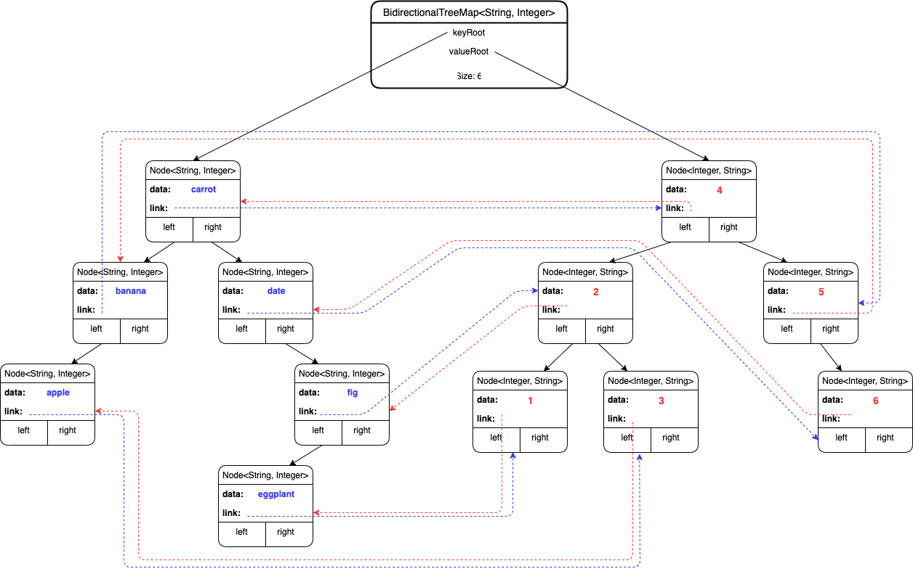

# COMP 128 Homework 4: Bidirectional Tree Map

### Project description

In this homework, you will be implementing a custom data structure called a Bidirectional TreeMap.
A Bidirectional TreeMap is similar to Java's TreeMap class in that it stores associations between keys 
and values. The standard TreeMap enables looking up a value by the key in O(logn) time, while also enabling 
iteration over the keys in sorted order. In addition to searching by key in O(logn) time, a Bidirectional 
TreeMap also allows you to search by value in O(logn) time.

The typical implementation of a TreeMap stores nodes containing the key and value in a single binary search
tree, ordered by the keys. Our Bidirectional TreeMap will instead be stored in two distinct binary search trees,
one storing the keys and one storing the values. The associations are stored as bidirectional links between
the nodes of the two trees.

The diagram below shows the structure of the implementation:

Note that the BidirectionalTreeMap has generics for two types, the key type and the value type. In this
example, the key type is String and the value type is Integer. We are currently storing 6 associations in
this structure. Note that in this initial example, the associations are "one-to-one". This means that there
are no repeated or duplicate keys *or* values.

Like a TreeMap, it is not possible to edit the key of an association, because that edit may disrupt the overall
binary search ordering property of the tree. Because the values of our BidirectionalTreeMap are also stored in
their own binary search tree, we must also prohibit editing of the values in a BidirectionalTreeMap. If the key
or the value of an association needs to be changed, that data must be removed from the tree and re-inserted, i.e. 
you cannot just call put again with the same key but a different value.

### Implementation

Your task for this homework is to implement the structure diagrammed above. We recommend
that you begin your implementation by following the structure of the `BinaryTree` and `BinarySearchTree` classes 
we worked with in the class activities. You will need to make a number of significant changes to the code, but the overall
design composed of a Node class and recursive methods remains
the same. Note that each class now has generics over two types rather than just one. 

For this assignment we will assume that the data stored in the structure is added and removed in a mostly
random fashion and that the binary tree remains sufficiently balanced so that we may claim that the maximum
height of the tree structures is not significantly greater than log n, where n is the number of associations
stored in the structure. In lecture, we will talk about algorithms for automatically rebalancing trees (but
you do not need to implement this for the homework).

The provided code in BidirectionalTreeMap illustrates the basic functionality of the map interface including the methods:
 size(), put(key, value), remove(key), getValue(key), getKey(value), containsKey(key), containsValue(value), inorderTraverseByKeys(),
 and inorderTraverseByValues(). Study the javadoc and provided tests carefully to deduce the expected behavior of the methods.
 You will need to add additional private methods to make the given methods function. Where possible, strive to reduce code duplication!
 
 Hints to avoid code duplication:
 
 - Method parameters with generics can be declared with wildcards, e.g. `Node<? extends Comparable, ?>`. This allows the generics
 to be either K or V and still allows you to call compareTo on the key. 
 - If you need a method parameter of type K *or* V, you can instead pass the data as a Node with wildcard generics, and reference the K or V variable using the Node's data variable.
 
 
 To receive full credit, you must have:
 
- Good method decomposition
- Little code duplication
- Correct Execution with passing tests
- Correct Style
